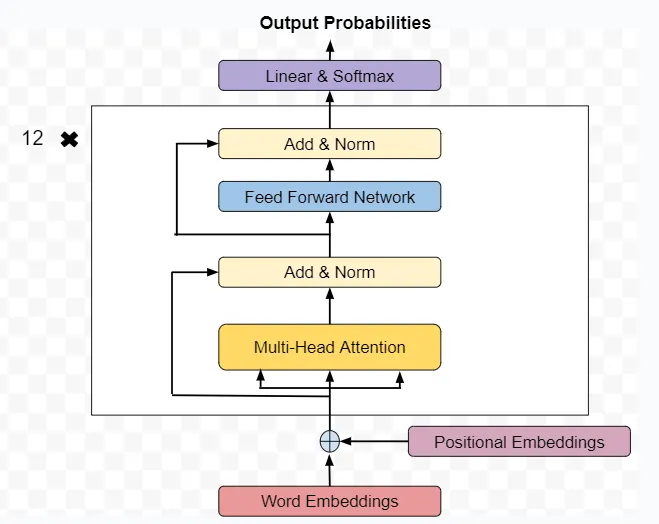
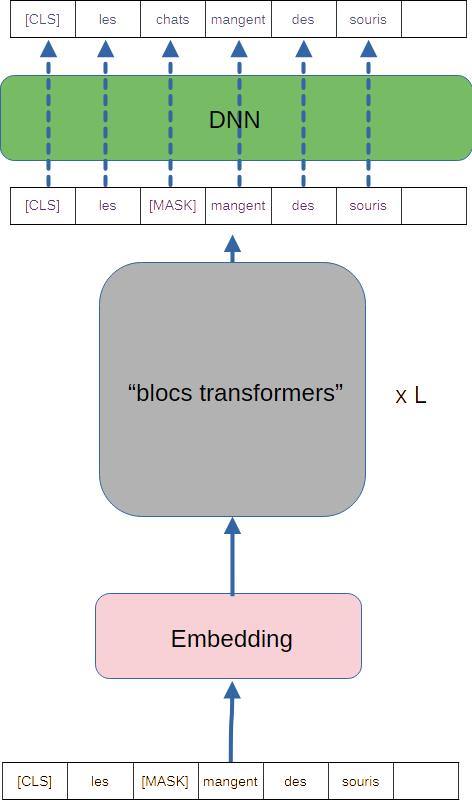

# BERT

## Introduction

**BERT** signifie **Bidirectional Encoder Representation from Transformer**. C'est un LLM (Large Langage Model), un modèle de grande taille dédié au traitement du langage, décrit dans [cette publication](https://arxiv.org/abs/1810.04805). Il a vu le jour en 2018 (la même année que GPT)

**Bert** est un modèle **encoder only**, qui est entrainé sur des tâches de **Masked Langage Modeling** et de **Next Sentence Prédiction**. Il vise à apprendre à encoder des séquences de texte de façon très efficace pour ces tâches. Nous reviendrons plus loin sur ces points.

Avec un modèle Bert pré-entrainé, il est possible de l'utiliser dans des **downstream tasks** (voir la section [GPT](GPT.md)), à condition de remplacer le module en sortie de Bert, de le remplacer par un module correspondant à la tâche souhaitée, puis de "fine tuner" le module final.

Ici, on commencera par s'intéresser à l'architecture de BERT, qui présente quelques spécificités intéressantes.

## Architecture de BERT

Voici une représentation de l'architecture de BERT.

Comme on peut le voir dans l'image précédente, il s'agit d'un encodeur transformers classique.

Notons néanmoins un point spécifique qui le distingue du transformer originel :
le **positional encoding** est ici effectué par une simple couche dense :
la position d'un token dans la séquence est un entier, transformé en *one hot vector* de dimension $s$, et ce vecteur passe dans la couche linéaire pour donner un vecteur de la dimension de l'embedding $e$. Cette couche est apprise pendant l'entrainement.

### Quelques chiffres

Voyons quelques chiffres concernant les deux principales versions de BERT :
La taille du vocabulaire est, dans les deux cas, fixée à $d_{dict}=30000$.

- BERT Base :
  - dimension de l'embedding $e=768$.
  - taille des séquences $s = 512$
  - nombre de couches d'encodeur : $L=12$
  - nombre de têtes d'attention par couches : 12 Attention,
  - nombre de neurones dans les couches cachées des Feed : 3072
  - nombre total de paramètres : 110M

La version plus grande de Bert est caractérisée comme suit :

- BERT Large :
  - dimension de l'embedding $e=1024$.
  - taille des séquences $s = 512$
  - nombre de couches d'encodeur : $L=24$
  - nombre de têtes d'attention par couches : 16 Attention,
  - nombre de neurones dans les couches cachées des Feed : 4096
  - nombre total de paramètres : 340M

### Apprentissage

Pour décrire cet apprentissage, ma description se fera en 3 étapes séparées, mais Bert applique toutes ces étapes.

Bert est pré-entrainé à réaliser deux tâches en parallèle, que voici :

#### Masked Langage Modelisation

La première tâche à laquelle Bert est entrainé est de reconstruire des phrases partiellement masquées.

Prenons la séquence (ici très courte) : `Les chats mangent des souris`

15% des token de la séquence vont être masqués en entrée, et remplacés par un
token spécial `[Mask]` ce qui pourrait donner la séquence `Les [Mask] mangent des souris`

L'objectif du réseau est de fournir, en sortie, un choix de token correct pour chaque token masqué. Ceci est fait comme illustré dans la figure suivante :

1. Les blocs d'attentions enrichissent chaque token de la séquence.
2. En sortie des transformers, les tokens `[Mask]` sont donc enrichis (en violet).
3. Le DNN est en charge de choisir, pour chaque token enrichi, le mot le plus probable (en bleu). 

Ici, on voit apparaitre un token spécial `[CLS]`, placé en début de séquence, et sans intérêt pour cette tâche, mais qui sera utilisé pour la prochaine.

### En prédiction

