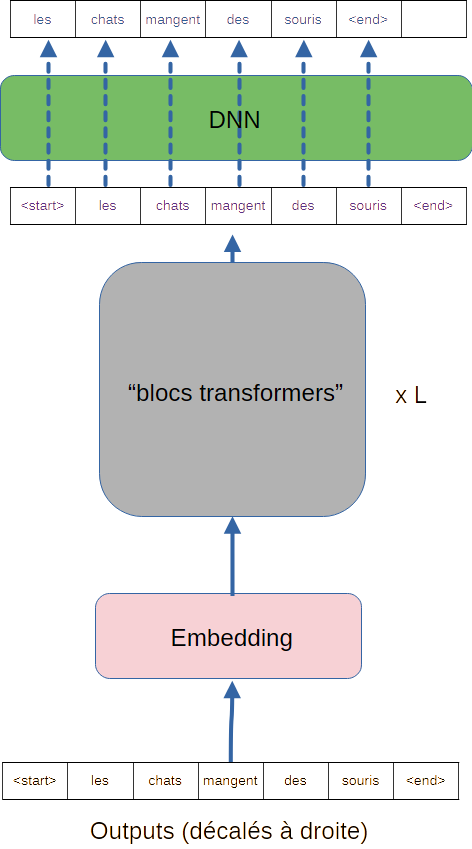

<script>
MathJax = {
  tex: {
    inlineMath: {'[+]': [['$', '$']]}
  }
};
</script>
<script defer src="https://cdn.jsdelivr.net/npm/mathjax@4/tex-chtml.js"></script>

# GPT

## Introduction

**GPT** signifie **Generative Pretrained Transformer**. C'est un LLM (Large Langage Model), un modèle de grande taille dédié au traitement du langage.
Il existe en de nombreuses versions, de 1 à 5 à ce jour. La version 1 a vu le jour en 2018.

Ici, nous parlerons surtout du plus célèbre, GPT3 (ouvert aux utilisateurs en 2020), qui est la base de chatGPT. **Le code source de GPT3, contrairement aux précédents modèles, n'est pas ouvert**. Néanmoins, on dispose d'articles présentant son architecture.

Un point de GPT, qui le distingue de la concurrence, est qu'il est entrainé sur une seule tâche (prédire le mot suivant d'une séquence) mais qu'il peut être utilisé pour des **tâches en aval** (*downstream task*) **sans entrainement supplémentaire**.

Une tâche en aval est une tâche différente, souvent plus précise que la **tâche en amont** (*upstream task*) pour laquelle il a été entrainé, correspondant à l'application finale que doit réaliser le modèle.

Par exemple : pour GPT, l'upstream task est, on l'a dit, de prédire le prochain mot d'une séquence. Voici quelques dowstream tasks réalisables, sans entrainement supplémentaire :

- prédire la tonalité émotionnelle d'un texte (commentaire positif ou négatif)
- résumer un texte
- corriger un texte de ses erreurs linguistiques
- répondre à des questions (chat bot)


Ce que nous allons voir maintenant va nous permettre de comprendre comment cela est possible.

## Principe de fonctionnement

GPT se base sur un **decoder only transformer**. J'invite donc le lecteur a être au point sur le contenu de la section [decoder_transformers](decoder_transformers.md) de ce cours. Bien avoir en tête le fonctionnement des [mécanismes d'attention](mecanisme_attention.md) est également bienvenu.

On le reverra dans la section architecture de cette page, mais dans un **decoder only transfomer**, il ne peut y avoir d'attention croisée, seulement des têtes d'auto-attention.

### Apprentissage

Re-voyons le fonctionnement en apprentissage, que nous avons déja croisé dans la partie decoder. Dans l'exemple qui est illustré ci-dessous,  on souhaite que le modèle travaille sur la séquence *"Les chats mangent des souris"* :



On décale cette séquence à droite, et elle est fournie au modèle en entrée (en bas). Sa tâche est de prédire quel est le mot suivant de chaque token de la séquence d'entrée. Ainsi, il doit prédire que le premier mot est *les*, et que le mot suivant *chats* est *mangent*. **GPT**, pendant l'entrainement, prédit toute la séquence en une passe.

Il faut noter qu'il s'agit bien d'une tâche **Non supervisée**, au sens où les données ne sont pas labelisées. Il suffit de fournir au modèle des portions de texte glanées un peu partout pour qu'il puisse s'entrainer.

Dans cette partie, le LLM va **apprendre une représentation du monde**, concernant la syntaxe des phrase, la grammaire, mais aussi sur les liens existants entre les différents tokens qu'il rencontre. Ainsi, il saura vraisemblablement que la *tour eiffel* est associé aux notion de *Paris*, *fer*,... Il fera la différence avec la *tour aux echecs*, dont il saura qu'elle est associée à la notion de *piece* et de *déplacement horizontal ou vertical*,

Ce sont les mécanismes d'attention, couplés à un volume de données d'entrainement énorme et un nombre de paramètres également énorme qui permettent cela.

*rappel technique : les têtes d'auto-attention doivent être masquées pour un fonctionnement causal. La prédiction d'un token ne doit dépendre que des token précédents dans les entrées (sinon, il pourrait utiliser le mot suivant des entrées pour prédire le mot suivant en sortie...)*

### En prédiction

Je vais présenter le fonctionnement sur plusieurs exemples, pour en explorer les subtilités. Pour chacun de ces exemples, je vais utiliser différentes **downstream tasks**.

#### Premier exemple : classification de tonalité émotionnelle

Imaginons que l'on veuille que le modèle nous indique à quelle classe de sentiments est associée le commentaire "ce film est nul*.

On commence par créer une séquence de texte, le **prompt** telle que :

```
parmi les différentes catégories suivantes :
 0: positif, 1: neutre, 2: négatif
Quel est le sentiment exprimé par le texte suivant ?
```

A cette séquence, on peut ajouter nos données :

```
ce film est nul
```

Ainsi, on ne demande au réseau que de produire un token, l'identifiant émotionnel associé au commentaire.

#### Deuxième exemple : chat bot

Le principe est identique : on introduit un prompt posant une question.

```Qui est le plus fort entre le crocodile et le lion et pourquoi ?```

1. Le LLM va introduire ce prompt en entrée et prédire le prochain mot (en test, ce mot à été : *il*.)
2. il ré-introduit la séquence complète, à laquelle est ajoutée son début de réponse, pour prédire le mot suivant.
3. on ré-itère ce processus jusqu'à obtention d'un token `[fin de séquence]`

*Pour information, GPT pense qu'il n'y a pas de réponse simple à cette question, et argumente...*

On peut alors lui poser de nouvelles questions, qu'il ajoute à la séquence d'entrée, tout en conservant l'historique des échanges passés (jusqu'à dépassement de la taille de séquence $s = 2048$ tokens)

C'est là tout l'intérêt d'un modèle **decoder only** pour un chat bot :
**Le contexte, qui définit ce que le LLM doit faire est très souple, facilement paramétrable et évolutif**.

On peut noter qu'au prompt proposé par l'utilisateur (**user prompt**), on ajoute en préalable un **prompt system** qui va guider le LLM, comme :

```
Vous êtes un agent IA qui a pour objectif de répondre de façon bienveillante aux utilisateurs. Vous êtes tolerants envers les différences ... 

Voici la requete de l'utilisateur :
```

Et voilà. tout est là, cela fonctionne étonnament bien.

## Architecture de GPT

Voici une représentation de l'architecture de GPT3, (*Par Original : Marxav, Vectorisation : Mrmw — Travail personnel basé sur : Full GPT architecture.png:, CC0, https://commons.wikimedia.org/w/index.php?curid=146645810*) :


Il n'y a rien de particulier à en dire, si l'on a compris le principe des decodeurs transformer, si ce n'est observer les chiffres qui suivent :

### Quelques chiffres

GPT 3 présente des caractéristiques assez impressionnantes en termes de taille :

- 175 milliards de paramètres.
- une taille de séquences de $s = 2048$
- une dimension d'embedding de $e = 12288$
- taille du vocabulaire $d_{dict} = 50257$
- Nombre de "blocs de Transformers" $L=96$
