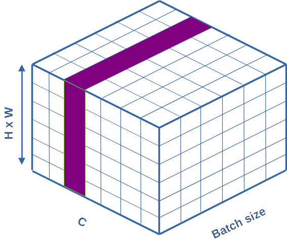

# batch normalisation

Je vais essayer de vous expliquer tout ça, sans trop vous abreuver de mathématiques, en commençant par l'intuition initiale de ses inventeurs. Pour le lecteur qui souhaiterait plus de rigueur, la normalisation des batch a été décrite pour la première fois dans l'article de Ioffe, S., & Szegedy, C. (2015).

Pour vous expliquer tout ceci, je vais commencer par prendre un réseau dense, et regarder ce qui peut se produire pendant l'apprentissage, avant de voir pourquoi la dite « normalisation par batch » peut nous aider.

## Cas des réseaux denses en apprentissage

Quelques points préalables :

- On a vu qu'en entrée d'un réseau de neurones, il est de bon que les données soient comprises dans l'intervalle [-1,1].
- Pour des données hétérogènes, il est préférable que les données en entrée soient standardisées, ou normalisées, de façon à avoir des valeurs évoluant sur des espaces comparables.

On peut s'assurer que cela soit le cas en entrée du réseau. Mais à l'intérieur du réseau, rien ne le garantit.

Quand le réseau doit traiter un lot de données (un batch), une couche à l'intérieur du réseau va recevoir des données en entrée, dont les valeurs varient autour de leur moyenne, d'une quantité liée a leur écart-type. On adapte donc les poids de cette couche à une distribution des données centrées autour de cette moyenne.

Pour le lot suivant, cette moyenne et cet écart-type ont changé. Les modifications qui ont été faites sur les poids à l'étape précédente n'ont peut-être plus de sens car la distribution des données en entrée a potentiellement complètement changé. Lorsque ce phénomène se produit en entrée du réseau, on parle de « **décalage de covariance** » (*covariance shift*).

Dans notre cas, nous nous intéressons à ce qu'il se passe dans le réseau, entre les couches internes. Les auteurs parlent donc d'un « **décalage de covariance interne** » (*internal covariance shift*) : un décalage de covariance qui se produit dans les couches cachées du réseau.

Le raisonnement des auteurs consistait donc à intercaler, à certains points dans le réseau une couche supplémentaire, permettant de limiter ce phénomène. Cette couche sera nommée couche de **normalisation par batch**. Son fonctionnement est décrit ci-dessous.

1. Nous travaillons bien à l'intérieur du réseau, les données en entrées ont donc été traitées par les couches précédentes.
2. La couche de normalisation par batch va calculer la moyenne $m$ et l'écart-type $s$ du batch de données injectées dans cette couche, puis normaliser chaque caractéristique (retirer la moyenne et diviser par l'écart-type). La distribution des entrées pour cette couche sera donc de moyenne nulle et d'écart-type 1.
3. Ce qui précède est une bonne idée, mais le coup de génie est le suivant. Pour chaque paramètre, la couche dispose de 2 paramètres qu'elle peut apprendre : la moyenne et l'écart-type souhaités pour ce paramètre. Ils seront notés respectivement $\beta$ et $\gamma$. Ces paramètres seront modifiés, pendant l'apprentissage, comme tout autre paramètre du réseau.

De ce fait, pendant l'apprentissage, on garantit plus ou moins que, pour chaque batch pendant l'apprentissage, la distribution en sortie de la couche de normalisation par batch soit centrée autour d'une valeur \(\beta\), et d'écart-type \(\gamma\).

La couche suivante, quelle qu'elle soit, travaillera donc en apprentissage sur une distribution plus maitrisée qu'initialement. Mieux, les paramètres $\beta$ et $\gamma$ permettent au réseau de choisir quelle distribution suit chaque paramètre.

Ça, c'était la version simple pour les réseaux denses en apprentissage.

Reprenons tout ceci rapidement

Soit un paramètre x en entrée de la couche. Celui-ci subit la transformation $x~ \rightarrow ~ x'~ \rightarrow ~ x"$ qui suit :

$$x' = (x - m)/s  ~~~ (normalisation)$$

$$x" = \gamma x' + \beta$$

- $m$ et $s$ sont respectivement la moyenne et l'écart-type du paramètre, estimés sur le batch actuel.
- $\beta$ et $\gamma$ sont respectivement la moyenne et l'écart-type de ce paramètre, en sortie de la couche, choisis par le réseau pendant l'apprentissage.

## Cas des réseaux denses en validation ou en prédiction

Quand on utilise un réseau en prédiction notamment, on ne fait pas forcément de batch. Calculer une moyenne et un écart-type sur un seul exemple serait donc très problématique. On ne peut donc pas calculer $m$ et $s$ en prédiction. Pour s'affranchir de ce problème, non décrit spécifiquement dans l'article originel, la solution actuelle consiste en ce qui suit :

Lors de l'apprentissage, le réseau va garder en mémoire la moyenne et l'écart-type des données vues jusqu'ici. Chaque fois qu'il apprend, il met à jour cette moyenne et cette variance. On parle de **moyenne et d'écart-type variable** (*moving average, moving deviation*). Ces paramètres ne sont pas modifiés pour optimiser la sortie du réseau, mais uniquement mémorisés.

En inférence (phase de validation ou de prédiction), ce sont ces moyennes et écart -types variables qui sont utilisés pour la normalisation en entrée, et non plus les moyennes et écart-types du batch. Les équations définies ci-dessus restent néanmoins valables.

## Nombre de paramètres de ces couches

Dans un réseau dense, les $N$ caractéristiques en entrée d'une couche sont un vecteur 1D. Sous forme de batch de $M$ entrées, cela forme un tenseur d'ordre 2, de taille $MxN$.

- La moyenne et l'écart-type sont estimés, pour chaque paramètre, sur les $M$ exemples. Cela forme 2 vecteurs de taille $N$ qui serviront :
    - à normaliser le batch ;
    - à mettre à jour les moyennes et les écart-types variables pour la phase d'inférence. Ces deux paramètres sont mémorisés.
- Le réseau apprend beta et gamma, qui sont également 2 vecteurs de taille $N$.

On a donc, au final, $4xN$ paramètres, dont $2xN$ appris (au sens de « servent à optimiser la loss du réseau »).

## Où placer ces couches de normalisation par batch ?

Initialement, les auteurs recommandent de les mettre entre la couche de sommation d'un réseau et sa fonction d'activation. Depuis, les choses ont évolué, et on les trouvera souvent après la fonction d'activation. Dans les réseaux que l'on a vus jusqu'ici, cela sera simplement des couches intercalées entre les couches denses habituelles.

## Justification théoriques

Depuis les travaux initiaux, l'idée que ces couches améliorent les performances en réduisant le décalage interne de covariance a été remis en cause par plusieurs articles, qui interprètent plutôt le résultat en terme de lissage de la fonction de coût. Ceci est discuté, par exemple, dans l'article de Santurkar, S., Tsipras, D., Ilyas, A., & Madry, A. (2018). 

Encore une fois, rien n'est actuellement vraiment clair, la seule chose qui prime, c'est qu'empiriquement, cela fonctionne assez bien.

## Résultats pratiques

Les auteurs signalent que la normalisation par batch :

- Limite le sur-apprentissage ;
- Baisse le nombre d'itération nécessaire à l'apprentissage ;
- Permet d'utiliser des learning rate plus important ;
- Permet d'accroître la décroissance du learning rate entre deux ajustement ;
- Fait revenir ton chien et protège du mauvais œil.

De fait, sur les petits réseaux (et les petites bases) que nous utilisons, certains de ces points sont difficilement observables. Néanmoins, ses effets pour limiter sur-apprentissage sont flagrants, même si je ne comprends pas vraiment pourquoi. Pour le chien, vous me direz.

## Cas des réseaux convolutifs

Bon, l'avantage c'est que si vous avez compris ce qui précède, cela fonctionne plus ou moins de la même façon pour les réseaux convolutifs à une différence près, que j'illustrerai dans le cas de données en entrée de type image.

Les données correspondant à un exemple en entrée sont un tableau 3D, de taille $hauteur x largeur x nb canaux$ (pensez RGB -> 3 canaux). C'est la feature map en entrée du réseau.

Plus généralement, les données correspondant à un exemple, à l'intérieur du réseau sont un tableau 3D de taille $H.W.C$ (Height x Width x number of map).

Un batch de M exemples sera donc un tenseur d'ordre 4 de taille $M.H.W.C$ (soit M images, chacune de taille HxW, comprenant C canaux ou maps).

Cela n'aura aucun sens de normaliser, sur l'ensemble du batch, l'ensemble des pixels correspondant à une position spatiale donnée (cela détruirait toutes les corrélation internes entre pixels d'une image).

De ce fait, dans les réseaux convolutifs, lorsqu'on estime la moyenne et l'écart-type du batch, on les estime sur l'ensemble des images, et pour l'ensemble des positions. On mesure donc une moyenne et un écart-type par canal. (Soit deux vecteurs 1D de taille $C$). De même, $\gamma$ et $\beta$, les moyennes et écarts-type en sortie sont appris et appliqués pour chaque canal. C'est également le cas pour la moyenne et l'écart-type variables mémorisés.

### Visualisation pour les CNN

Essayons de visualiser un peu le fonctionnement de la normalisation par batch dans des données réelles dans des CNN.

Notre réseau travaille sur des batchs de taille $B$, composés de $C$ features map, de taille $H \times W$. Nos données sont donc des tenseurs d'ordre 4, difficiles à représenter. Dans les figures suivantes, j'ai aggloméré $H$ et $W$ sur une seule dimension. Nos données seront donc représentées par des cubes de données.

Ainsi, la figure suivante présente, en vert, une feature map quelconque de la première image d'un batch.

La figure qui suit présente, en violet, l'ensemble des données impliquées dans la normalisation d'une feature map donnée sur tout le batch. Pour chacune des tranches parallèles à celle présentée :

- le réseau mesure un couple de moyenne, variance $(m,\sigma)$ spécifique à cette tranche.
- le réseau apprend un couple $(\gamma,\beta)$ spécifique à cette tranche.

### Nombre de paramètres de ces couches

Juste pour poser les choses : imaginez une couche de normalisation par batch qui travaille sur des batchs de taille 32, et 128 maps de taille 512 x 1024. Quelle est le nombre de paramètres de cette couche ?

Chaque paramètre est de taille 128 (une moyenne variable par map, un écart type variable par map, un $\beta$ par map et un $\gamma$ par map), soit $4x$ le nombre de map en entrée de la couche. Ici encore, seuls $\beta$ et $\gamma$ sont appris (modifiés pour optimiser la loss). Les deux autres sont juste mémorisés au cours de l'apprentissage.

### Où placer ces couches de normalisation par batch ?

Ici encore, ce sont les résultats expérimentaux qui priment. Actuellement, on trouve souvent ces couches APRÈS une couche de convolution (et sa fonction d'activation) et AVANT une couche de pooling.

Voila, nous avons maintenant les bases suffisantes pour tester ceci, les frameworks actuels implémentent ces couches de façon très transparente pour l'utilisateur.