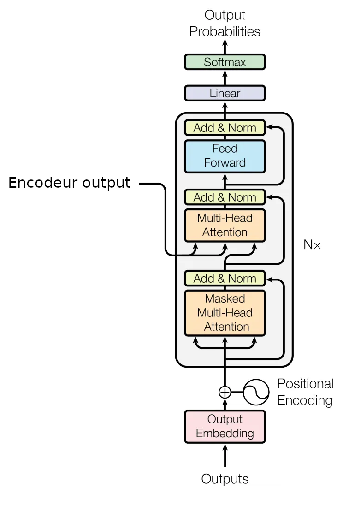
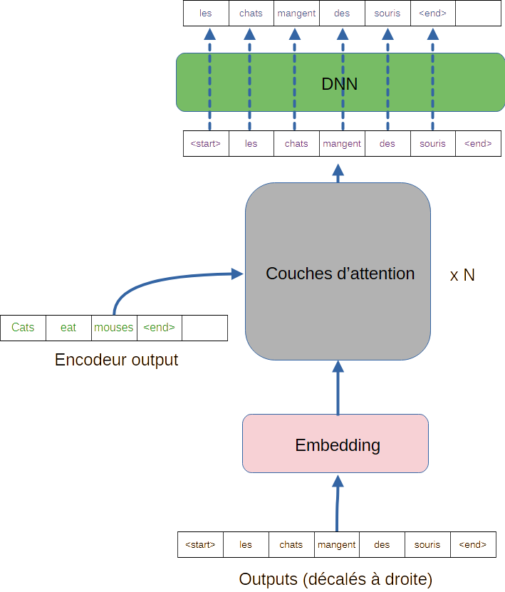

# Le décodeur des Transformeurs

Comme dans toute [architecture encodeur/décodeur](encoder_decoder.md), l'objectif est de pouvoir travailler sur un problème **sequence to sequence**,
et de produire **le prochain élement de la séquence de sortie**.

## Architecture du décodeur

Voyons donc l'architecture du décodeur, présentée ci-dessous :

Pour comprendre ce qu'il se passe, imaginons que notre Transformer fasse de la traduction anglais / francais, et, à partir de la phrase "cats eat mouses", il doive au final produire la séquence "les chats mangent des souris".

Plus précisément, au stade qui nous intéresse, à partir du début de traduction "`<start>` les chats mangent", il doivent produire le mot prochain mot de la séquence de sortie : le mot "des".

Commencons par la partie basse de la figure précédente :

1. Comme dans l'encodeur, la séquence "`<start>` les chats mangent" est encodée par un réseau dense, appris.
2. Cet encodage est aussi complété par un encodage de position, ajouté à l'embedding.

Ce sont ces outputs précédents, encodés, qui vont entrer dans la couche d'attention du décodeur que nous décrivons maintenant :

1. Cet embedding est enrichi par un bloc d'auto-attention multi tête pour que chaque mot de la séquence "les chats mangent" soit enrichi par le contexte des autres mots de cette séquence.
2. Cette version enrichie est encore enrichie par un autre bloc d'attention, cette fois-ci croisée. L'attention est ici portée à la séquence complète venue de l'encodeur : le Context Vector correspondant à la séquence "cats eats mouses". On peut donc imaginer notre séquence en sortie de cet étage comme "les chats mangent", ou chaque mot est enrichi par le contexte de la séquence et par le contexte global "cats eats mouses".
3. Chaque vecteur de cette séquence est également enrichi par l'ajout d'une sortie de réseau feed-forward (*dont l'intérêt ne me saute toujours pas aux yeux*)

Dans le décodeur, ces couches d'attention sont répétées $N$ fois, en série.

Enfin, pour la prédiction finale du prochain token, on utilise un réseau feedforward qui possède $d_{dict}$ sorties, avec $d_{dict}$, le nombre de token possible dans le dictionnaire de langue francaise.

## Eléments importants du décodeur

En fait, j'ai un peu menti dans ce qui précède, pour mieux expliquer le principe sous-jacent. Nous allons ici être plus précis.

### Fonctionnement en apprentissage

Pour cela, observons la figure suivante, qui représente ce qu'il se passe
**en apprentissage**.

- La sortie du classifieur est enrichie par l'encodeur et figure en *vert*.
- La séquence à prédire est intégralement fournie en entrée du décodeur, (en *noir*)
- cette séquence traverse l'embedding, et est fournie aux couches d'attention,
ainsi que la sortie de l'encodeur. La sortie de l'encodeur est ainsi enrichie
et est illustrée par la séquence en *violet*.
- cette séquence passe à travers le DNN, qui **pour chaque mot, prédit le mot suivant**. La sortie du DNN est la sortie prédite, en *bleu*.

Ainsi, on voit qu'en apprentissage, on ne fait qu'**une seule prédiction**, de toute la séquence de sortie, ce qui limite énormément le temps de calcul.

En revanche, si les couches d'auto-attention des modules d'attention ont accès à la totalité de la séquence à prédire, elles pourraient se servir du mot à droite de celui qu'elle doivent enrichir. Auquel cas, on leur demanderait de prédire une réponse dont elles ont connaissance !

C'est pourquoi les couches d'auto-attention dans le décodeurs utilisent une **attention masquée**, telle que décrite dans [cette partie](mecanisme_attention.md). Pour rappel, cela consiste à fixer à $-\infty$ les coefficients de la matrice de pattern d'attention avant d'en prendre le softmax. Ainsi, un mot de la séquence ne peut être enrichi que par les outputs qui le précèdent dans la phrase.

Cela signifie aussi que **chaque token enrichi en entrée du DNN doit porter toute l'information pertinente qui le précède** puisque le DNN ne se fonde que sur ce token enrichi pour prédire le mot correspondant. 

*Cela m'a pris un certain temps pour comprendre cette partie...*

### Fonctionnement en inférence

Si le système doit traduire une phrase quelconque, comme "*Not all those who wander are lost*", on ne dispose pas d'une séquence de sortie initialement.

Dans ce cas, le fonctionnement est le suivant :

1. l'encodeur encode cette phrase complète, qu'il passe au décodeur.
2. le décodeur doit maintenant produire toute la séquence mot à mot. Pour cela,
on commence par lui injecter une séquence vide, avec seulement *`<start>`* complètement à droite.
3. on n'observe que le dernier mot prédit par le réseau. Il correspond à la dernière case de la séquence en sortie du DNN ("tous")
4. on recommence en inserant en bas du décodeur une séquence vide avec *`<start>`,Tous*. qui prédit le prochain mot. On réitère ensuite depuis 3. jusqu'à obtention d'un token *`<end>`* en sortie du DNN.

Ici encore, cela signifie qu'en inférence, le dernier token enrichi en entrée du DNN doit porter **toute l'information pertinente de la phrase à traduire et du début de traduction produite** puisque le DNN ne se fonde que sur ce token enrichi pour prédire le prochain mot. Cela implique que les mécanismes d'attention sont suffisament complexes pour permettre cela.

*Idéalement, notre Transformer génèrera la séquence suivante* :**Tous ceux qui errent ne sont pas perdus**

Et voilà ! 

