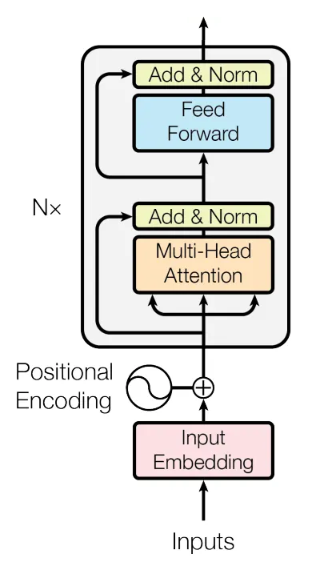

# L'encodeur des Transformers

Comme son nom l'indique, l'encodeur des transformers a pour objectif d'encoder la séquence d'entrée en une séquence dans laquelle chaque vecteur de la séquence encodée bénéficie d'une [attention](mecanisme_attention.md) relative aux autres vecteurs de la séquence.

En sortie de l'encodeur, la séquence est de taille fixe.

L'encodeur met également en place un certain nombre de mécanismes importants, tels que l'injection d'information de position dans les vecteurs d'entrée.

## Architecture globale de l'encodeur

La figure ci-dessous, extraite de l'article *Attention is all you need* présente cette architecture

Comme on peut le voir, cette architecture est composée de :

- Un bloc d'**encodage des entrées** (*Input embeddings*)
- Un bloc d'**encodage des positions**.
- une série de $N$ **couches d'attentions** en série. ($N=6$ dans l'article originel)

Le bloc d'encodage des entrées produit en sortie une séquence de vecteurs.
Chaque vecteur d'entrée sera traité indépendamment pour produire un vecteur de dimension $e$. Si l'on note $s$ la taille de la séquence, la sortie du bloc d'encodage associée à chaque séquence est un tenseur de taille $s \times e$
(nous reviendrons dessus plus loin)

Le bloc d'encodage des positions doit produire, pour chaque vecteur de la séquence d'entrée, un vecteur, lui aussi de taille $e$, représentant la position du vecteur dans la séquence. On peut, pour fixer les idées, penser à un *one hot vector* de dimension $s$. Dans la pratique, c'est plus complexe que cela. (Nous reviendrons également sur ce point plus loin).
La sortie du bloc d'encodage associée à chaque séquence est donc également un tenseur de taille $s \times e$

Un point surprenant des transformers est que les **sorties de ces deux blocs sont simplement sommées**. Cela signifie qu'avant d'être traitée par les couches d'attention, chaque item de la séquence est représenté par un vecteur de taille $e$, qui contient, additionnées, des informations liées à la nature du problème à traiter (informations sémantiques pour de l'analyse de texte, ou de colorimétrie pour de l'analyse d'image) et des informations liées à la position du vecteur dans la séquence.

## Description d'une couche d'attention

Dans chacune de ces couches, on trouve :

- un bloc d'auto-attention multi-tête.
- l'attention calculée par ce bloc est ajoutée au tenseur représentant la séquence. Chaque vecteur de la séquence est donc enrichi par le contexte donné par les autres vecteurs de la séquence.
- La séquence est normalisée (**pas encore très clair**)
- On traverse alors un réseau de neurone feedforward qui traite chaque vecteur de la séquence indépendamment et de la même façon. Ce réseau est composé, dans le papier originel, d'une couche cachée de $d_{ff} = 4 times e = 2048$ neurones et d'une couche de sortie de dimension $e$. Ces deux couches utilisent une fonction d'activation ReLU. Ce réseau interne modifie l'information associée à chaque vecteur. *Je ne sais pas trop à quoi cela sert, si ce n'est que ces réseaux apprennent, cela doit donc donner de la latitude à l'encodeur pour choisir la représentation de chaque séquence*.
- Cette sortie du réseau feed-forward est ajoutée à la séquence et le tout encore une fois normalisé (**toujours pas clair**)

Ainsi, la séquence en sortie d'une couche d'attention a forcément **la même taille** que la séquence en entrée.

Un certain nombre de couches d'attention sont ainsi enchainées, pour produire en sortie de l'encodeur des séquences de dimensions $s \times e$.

Il est vraisemblable qu'empiler des couches d'attention plutôt que de faire des têtes d'attention avec un plus grand nombre de têtes permet de générer une information plus riche *(un peu comme empiler des couches de convolution est plus intéressant que de faire une seule couche avec plus de features map)*.

