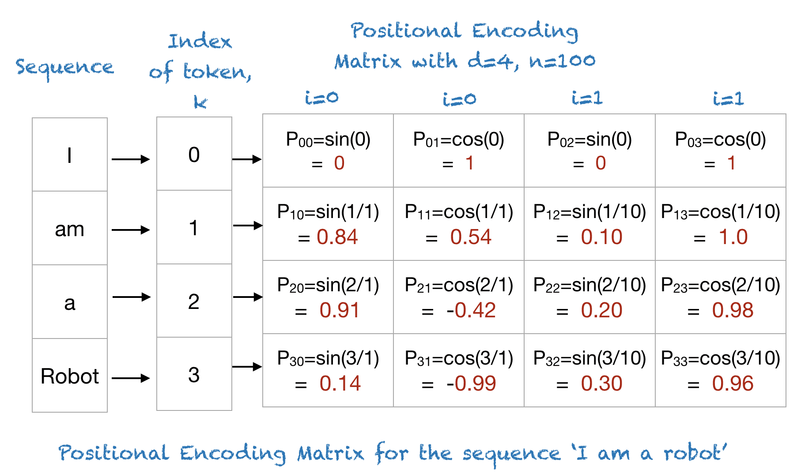

# L'encodeur des Transformers

Comme son nom l'indique, l'encodeur des transformers a pour objectif d'encoder la séquence d'entrée en une séquence dans laquelle chaque vecteur de la séquence encodée bénéficie d'une [attention](mecanisme_attention.md) relative aux autres vecteurs de la séquence.

En sortie de l'encodeur, la séquence est de taille fixe.

L'encodeur met également en place un certain nombre de mécanismes importants, tels que l'injection d'information de position dans les vecteurs d'entrée.

## Architecture globale de l'encodeur

La figure ci-dessous, extraite de l'article *Attention is all you need* présente cette architecture

Comme on peut le voir, cette architecture est composée de :

- Un bloc d'**encodage des entrées** (*Input embeddings*)
- Un bloc d'**encodage des positions**.
- une série de $N$ **couches d'attention** en série. ($N=6$ dans l'article originel)

Le bloc d'encodage des entrées produit en sortie une séquence de vecteurs.
Chaque vecteur d'entrée sera traité indépendamment pour produire un vecteur de dimension $e$. Si l'on note $s$ la taille de la séquence, la sortie du bloc d'encodage associée à chaque séquence est un tenseur de taille $s \times e$
(nous reviendrons dessus plus loin)

Le bloc d'encodage des positions doit produire, pour chaque vecteur de la séquence d'entrée, un vecteur, lui aussi de taille $e$, représentant la position du vecteur dans la séquence. On peut, pour fixer les idées, penser à un *one hot vector* de dimension $s$. Dans la pratique, c'est plus complexe que cela. (Nous reviendrons également sur ce point plus loin).
La sortie du bloc d'encodage associée à chaque séquence est donc également un tenseur de taille $s \times e$

Un point surprenant des transformers est que les **sorties de ces deux blocs sont simplement sommées**. Cela signifie qu'avant d'être traitée par les couches d'attention, chaque item de la séquence est représenté par un vecteur de taille $e$, qui contient, additionnées, des informations liées à la nature du problème à traiter (informations sémantiques pour de l'analyse de texte, ou de colorimétrie pour de l'analyse d'image) et des informations liées à la position du vecteur dans la séquence.

## Description d'une couche d'attention

Dans chacune de ces couches, on trouve :

- un bloc d'auto-attention multi-tête.
- l'attention calculée par ce bloc est ajoutée au tenseur représentant la séquence. Chaque vecteur de la séquence est donc enrichi par le contexte donné par les autres vecteurs de la séquence.
- La séquence est normalisée (voir la section [Layer Normalisation](layer_norm.md))
- On traverse alors un réseau de neurone feedforward qui traite chaque vecteur de la séquence indépendamment et de la même façon. Ce réseau est composé, dans le papier originel, d'une couche cachée de $d_{ff} = 4 \times e = 2048$ neurones et d'une couche de sortie de dimension $e$. Ces deux couches utilisent une fonction d'activation ReLU. Ce réseau interne modifie l'information associée à chaque vecteur en la **projetant dans un nouvel espace**, plus propice à l'opération générale réalisée par le réseau.
- Cette sortie du réseau feed-forward est ajoutée à la séquence et le tout encore une fois normalisé comme présenté au dessus.

Ainsi, la séquence en sortie d'une couche d'attention a forcément **la même taille** que la séquence en entrée.

Un certain nombre de couches d'attention sont ainsi enchainées, pour produire en sortie de l'encodeur des séquences de dimensions $s \times e$.

## remarques sur les couches d'attentions

La premiere remarque importante est qu'il est en fait nécessaire d'**empiler des couches d'attention**. Cela permet plusieurs choses :

1. De bien propager l'attention calculée dans toute la séquence. Pensez par exemple à la phrase *"La souris grise est sur le bureau. Elle est racordée à l'ordinateur"*. Une couche d'attention multi-tête va peut être se donner de la couleur à la souris, et associer le mot "elle" à la souris et à un ordinateur. Elle ne pourra pas, en revanche, enrichir le mot "elle" avec le sens d'une "souris grise", ni enrichir la souris avec le contexte d'ordinateur associé à "elle". Il faut pour cela 2 étages ou plus d'attention.
2. Cela permet de calculer des attentions sur les résultats des attentions précédentes. Par exemple, un premier étage d'attention pourrait s'interesser à l'emplacement géographique des différents acteurs d'une séquence (certains sont à Paris, d'autres à Munich). Le second étage pourrait alors s'interesser à définir quels acteurs sont au même endroit.

La seconde remarque, non moins importante, concerne la présence du DNN au sein du bloc d'attention. On l'a dit, il projette chaque vecteur dans un nouvel espace, plus propice à la réalisation de la tâche générale du réseau.
 **Cela implique aussi que l'on ne peut plus interpréter les vecteurs en sortie des couches d'attention dans l'espace initial d'embedding**.

## Encodage de position

Cet encodage de position est réalisé en entrée de l'encodeur. Il existe de nombreuses façons de le réaliser, et on peut les séparer en deux grandes catégories : fixes ou apprises.
Dans les deux cas, il s'agit, pour chaque numéro de position $k \in \{1..s\}$, de produire un vecteur de taille $e$, représentatif de la position d'un vecteur dans la séquence.

### Encodage Appris

Dans ce cas, chaque numéro de position est transformé en *one hot vector* (de dimension $s$), qui est passé à un réseau feed forward, de dimension de sortie $e$.

Ainsi, c'est l'apprentissage qui guide la façon dont la position est encodée. C'est ce qui est fait dans les Vision Transformers (*ViT*).

### Encodage fixe

J'imagine qu'il doit en exister de multiples version. Ici, je ne détaillerais que celle qui est utilisée dans *Attention is all you need*.

On veut encoder une position ($k \in \{0..s-1\}$) en un vecteur $P(k)$ de dimension $e$. On pourra noter $P(k) = [P_0(k),P_1(k),... P_e(k)]$

On cherche donc à calculer $P_p(k), ~pour ~p \in \{1..e\} ~et ~k \in \{1..s\}

L'encodage est donné par 2 équations, en fonction de la parité de $p$:

$$P_p(k) = sin(\frac{k}{n^{2i/e}}) ~~si~ p=2i$$

$$P_p(k) = cos(\frac{k}{n^{2i/e}}) ~~si~ p=2i+1$$

Dans l'article originel, la valeur de $n$ est fixée à $n=10000$.

Une image, prise [ici](https://machinelearningmastery.com/a-gentle-introduction-to-positional-encoding-in-transformer-models-part-1/), résume ce traitement :

**Remarque :** Vu que, dans l'article *Attention is all you need*, les auteurs notent que les performances avec cet encodage sont quasiment identiques à celles obtenues avec un encodage appris, je n'y consacrerais pas plus de temps...

## Input embedding

Toute séquence doit être encodée en une matrice de taille $s \times e$ avant de traverser les couches d'attention.
Prenons deux exemples pour fixer nos idées.

### Cas textuel

Soit une phrase quelconque, comme *"le chat mange la souris"*, que l'on voudrait injecter dans l'encodeur. Cette phrase est préalablement découpée en tokens, qui correspondent plus ou moins à des mots du dictionnaire (voir [la section dédiée aux tokens](tokens.md) pour plus de précisions)

Chaque token à de fait un indice dans le dictionnaire de tokens. Cet indice est transformé en *one hot vector* dans un espace de dimension $d_{dict}$. $d_{dict}$ est la taille de notre dictionnaire de tokens. Par exemple, le dictionnaire de token de GPT3 est de taille $d_{dict} = 50257$.

Chaque vecteur est alors de taille $d_{dict}$, qu'il faut transformer en un vecteur de taille $e$. La solution classique consiste à utiliser un réseau Feedforward dense, à $d_{dict}$ entrées et $e$ sorties. Les poids de ce réseau seront fixés pendant l'apprentissage.

Il faut noter que c'est cette partie qui va s'assurer que deux mots de sens proches seront encodés par des vecteurs proches.

Ainsi, la représentation de notre phrase initiale est passée d'une matrice de dimension $4 \times d_{dict}$ à une matrice de taille $4 \times e$. Néanmoins, les encodeurs travaillent souvent avec des séquences de taille fixe. Ceci peut être réglé à l'aide d'un simple **padding**, ramenant toute séquence à une matrice de taille $s \times e$.

### Cas d'images

Traitons rapidement un exemple fictif d'images. Un token dans un image peut être un pixel (un vecteur de taille $3$ pour une image RGB), ou un patch de $m$ pixels (un vecteur de taille $3 \times m$).

Ici, encore, il faudra transformer ce token en un vecteur de dimension $e$, et la solution consistera en un simple réseau feed-forward de dimensions adaptées.

En ce qui concerne la longueur de la séquence, les réseaux utilisant des transformers pour la vision sont souvent construits pour des images de taille fixe, ce qui règle le problème de séquences de taille variable.
