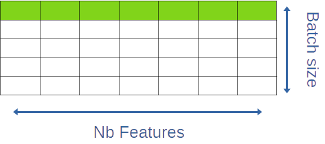
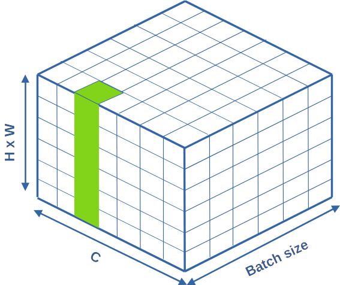
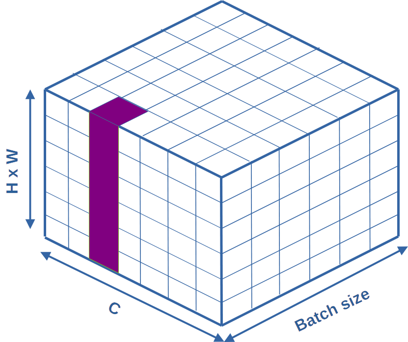
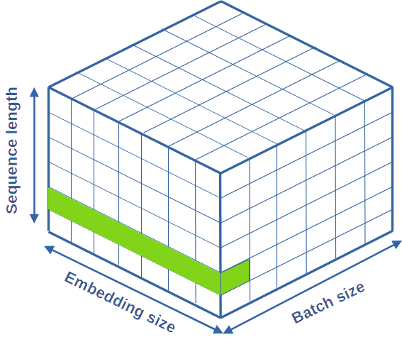

# Layer normalisation

Pour bien comprendre ce qui suit, je recommande de lire la section sur la [batch normalisation](batch_norm.md) avant d'attaquer ceci.

Pour le lecteur qui souhaiterait plus de rigueur, la normalisation par couches a été décrite pour la première fois dans l'article de Ba et al., 2016

L'idée est, comme dans le cas de la *batch normalisation*, de reconfigurer les distributions de features autour d'une moyenne et d'une variance apprises par le réseau pendant l'apprentissage.

Les formules de base qui vont nous servir ici sont exactement les mêmes que dans le cas de la batch normalisation :

Soit un vecteur $x$, correspondant **à un item du patch**, en entrée de la couche. 

Celui-ci subit la transformation $x~ \rightarrow ~ x'~ \rightarrow ~ x"$ qui suit :

$$x' = (x - m)/\sigma  ~~~ (normalisation)$$

$$x" = \gamma x' + \beta$$

- $m$ et $\sigma$ sont respectivement la moyenne et l'écart-type des features de l'item.
- $\beta$ et $\gamma$ sont respectivement la moyenne et l'écart-type de cet item, en sortie de la couche, choisis par le réseau pendant l'apprentissage.

## Cas des réseaux denses.

La figure suivante présente une illustration du mécanisme de **layer normalisation** dans un réseau dense.

Dans cette figure, toutes les features du premier item du batch sont représentées en vert.

C'est sur chacune des tranches parallèles à celle présentée que va s'opérer la **layer normalisation**. 

1. le réseau mesure un couple de moyenne, variance $(m,\sigma)$ spécifique à cette tranche.
2. il applique la formule de normalisation sur la tranche
3. Il applique la formule de scaling de moyenne et de variance sur cette tranche.

A l'issue de cette opération, chaque tranche (item) à pour moyenne $\beta$ et pour écart type $\sigma$. $\beta$ et $\sigma$ sont appris par le réseau.

(*Il me semble que tout ceci est plus ou moins équivalent à un scaling général des paramètres de la couche suivante...*)

Contrairement à la batch normalisation, **il n'y a aucune différence de fonctionnement entre l'apprentissage et l'inférence**.

### Nombre de paramètres de ces couches

Dans un réseau dense, les $N$ caractéristiques en entrée d'une couche sont un vecteur 1D. Sous forme de batch de $B$ entrées, cela forme un tenseur d'ordre 2, de taille $B \times N$.

- La moyenne et l'écart-type sont estimés, pour chacun des $B$ items
- Le réseau apprend $\beta$ et $\gamma$, qui sont également 2 scalaires.

On a donc, au final, $2$ paramètres appris (au sens de « servent à optimiser la loss du réseau »).

### Où placer ces couches de layer normalisation ?

Initialement, les auteurs recommandent de les mettre entre la couche de sommation d'un réseau et sa fonction d'activation. Depuis, les choses ont évolué, et on les trouvera souvent après la fonction d'activation. Dans les réseaux que l'on a vus jusqu'ici, cela sera simplement des couches intercalées entre les couches denses habituelles.

### Justification théoriques

A écrire

### Résultats pratiques

à écrire

## Cas des réseaux convolutifs

A priori, le papier présentant la layer normalisation signalait que cette normalisation n'était pas recommandée pour les CNN. Néanmoins, depuis, il semble que Liu et al., dans "A ConvNet for the 2020s" montrent que cela fonctionne aussi, voir mieux qu'avec une batch normalisation...

Quoiqu'il en soit, je vais essayer d'illustrer ce que j'ai compris du fonctionnement de la layer norm dans des CNN.

### Visualisation pour les CNN

Notre réseau travaille sur des batchs de taille $B$, composés de $C$ features map, chacun de taille $H \times W$. Nos données sont donc des tenseurs d'ordre 4, difficiles à représenter. Dans les figures suivantes, j'ai aggloméré $H$ et $W$ sur une seule dimension. Nos données seront donc représentées par des cubes de données.

Ainsi, la figure suivante présente, en vert, une feature map quelconque de la première image d'un batch.

Ce dont je suis completement sûr, c'est que :

- chaque item du batch subit les même transformations.
- le résultat pour un item est indépendant des autres items du batch.

Ce dont je suis presque sûr, c'est que :

- tous les pixels d'une feature map doivent subir la même transformation
(sinon, on brise la cohérence entre les positions spatiales d'une feature map)

La seule question est : est ce que tous les canaux sont traités ensemble ? il me semble bien que non, je dois faire des tests pour le vérifier en comptant les paramètres.

La figure qui suit présente *(selon moi)*, en violet, l'ensemble des données impliquées dans la layer normalisation. Pour chaque canal,

- le réseau mesure un couple de moyenne, variance $(m,\sigma)$ spécifique à ce canal.
- le réseau apprend un couple $(\gamma,\beta)$ spécifique à cette canal.

### Visualisation pour les Modèles de languages et Transformers

Bon, de fait, la **layer normalisation** a été inventée pour les RNN pour le traitement du langage naturel, puis reprise par les Transformers, avant (semble-t-il) de commencer à faire son apparition dans les CNN.

Précision également que la **batch normalisation** posait des problèmes aux modèles de language. En particulier, du fait de séquences de taille différentes, certains paramètres étaient normalisés avec beaucoup de composantes vides au sein d'un batch. 

Pour voir comment cela se passe dans des données séquentielles, on va commencer par visualiser les données d'un batch. La figure suivante présente, en vert, le vecteur correspondant au deuxieme item de la première séquence du batch.

Ici encore, c'est le long de l'embedding qu'opère la layer norm, en normalisant la moyenne et la variance de chaque mot d'une séquence. Il semble logique de ne pas modifier la "direction générale" du vecteur de l'item, qui porte son sens.
(de fait, on lui fait subir une translation de $-\beta$, mais l'idée est là).

1. Le vecteur d'un item de la séquence est affecté globalement.
2. chaque item d'une séquence est normalisé différement (chacun à son $\beta$ et $\gamma$)
3. Au sein d'un batch, tous les items de subissent le même scaling.

Ainsi, sauf erreur de ma part (*je suis plutôt confiant*), si notre séquence est de taille $s$, la couche doit apprend $2 \times s$ paramètres, peu importe la taille du batch et de l'embedding.

Dans les RNN, le fait d'avoir un $\beta$ et un $\gamma$ par item de la séquence était plus ou moins nécessaire (du fait des méthodes de backprop dans les RNN).
Dans un transformer, cela ne se justifie pas forcément, mais semble raisonnable.

