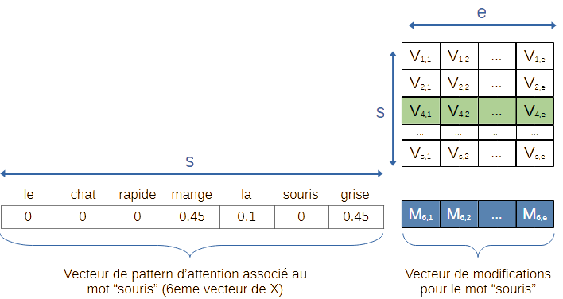
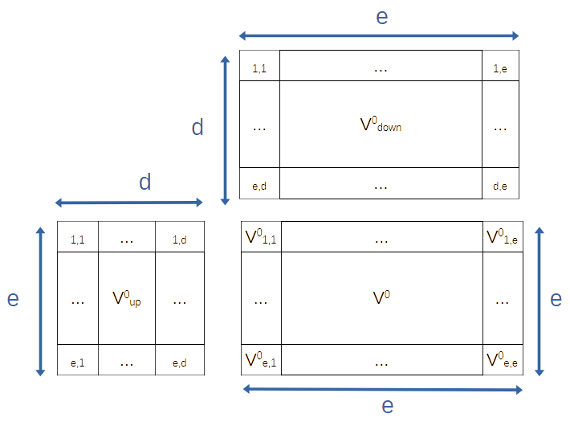

# Les Mecanismes d'Attention

On retrouve ces mécanismes dans les Transformers, évidemment, mais ils ont été repris un peu partout dans les réseaux de neurones qui **traitent des séquences**.

Ces mécanismes d'attentions sont connus depuis assez longtemps. Le très célèbre article "Attention is All you need" présente le premier réseau non récurrent utilisant ces mécanismes d'attention.

En revanche, sa présentation des mécanismes d'attention est notoirement compacte, puisqu'elle tient en une équation :

$$Attention(Q,K,V) = softmax(\frac{Q \times K^\intercal}{\sqrt(d)}) V $$

Voyons donc ceci de plus près.

## Principe de base.

Comme on l'a dit, ces mécanismes d'attention ne sont utiles que pour le traitement de séquences (*eg : texte, séquence temporelle comme des sons, séquence spatiale comme les images*). Modélisons donc ces séquences.

Une séquence d'entrée est une liste des vecteurs de la séquence. Notons $s$ la taille de cette séquence. On notera $e$ (comme *embedding*), la taille des vecteurs de la séquence.

Une séquence $X$ peut donc se mettre sous la forme : $X = [X_1,...,X_{s_s}]$, avec $X_i = [X_{i,1},...,X_{i,e}]$

On peut aussi la représenter sous une forme matricielle, comme dans l'image ci-dessous :

L'idée des mécanismes d'attention est de transformer la séquence pour que chaque vecteur $X_i$ prenne en compte le **contexte** (les autres vecteurs de la séquence).

la séquence d'entrée $X$ devient une séquence de sortie $Y$ dans laquelle chaque vecteur composant $Y$ prend en compte certains autres vecteurs de la séquence $X$.

Pour bien comprendre l'intérêt de cette attention, voyons deux débuts de phrases.

- "une souris grise"
- "une souris d'ordinateur grise"

On voit ici clairement que le concept caché derriere le mot "souris" a dramatiquement changé du fait du contexte. D'une part, le mot "grise" nous permet de lui donner une couleur, mais la présence ou non de la portion "d'ordinateur" transforme un mammifère en matériel informatique !

## Un exemple textuel

Prenons un exemple pour précisez les principes utilisés. Imaginons que notre séquence soit composée de mots. Par exemple, la phrase suivante : **le chat rapide mange la souris grise.**

Supposons de plus que chaque mot soit encodé par un vecteur dans un espace sémantique (ou chaque direction possède un sens particulier), dans l'espace des embedding de dimension $e$.

On peut alors imaginer qu'à l'issue du mécanisme d'attention, chaque mot de la phrase soit modifié comme suit dans $Y$ :

- le mot *chat* porte maintenant l'information qu'il est *rapide* (du fait de l'adjectif "rapide"). Il porte aussi peut être l'information qu'il est *masculin*  (du fait de l'article "le"). Enfin, il est peut être *repu*, du fait qu'il a mangé une souris.
- le mot *souris* porte maintenant l'information qu'elle est *grise* (du fait de l'adjectif "grise"), mais peut être aussi qu'elle est *morte*, puisqu'elle est mangée par le chat.

La figure suivante représente une partie des différents vecteurs de la séquence d'entrée $$X$$ (*ainsi que la direction "mort", dont j'aurais besoin par la suite*).

Celle figure (comme les suivantes) est schématique, car elle représente les vecteurs dans un espace de dimension 3. En réalité, on travaille dans des espaces de bien plus grandes dimensions.

Observons ce qui se passe pour le vecteur représentant la souris. Initialement, il s'agit du 6ème vecteur de la séquence $X$. Après le mécanisme d'attention, il s'agit du 6ème vecteur de $Y$.

L'action du mécanisme d'attention est représentée dans la figure suivante.
Le mécanisme d'attention va ajouter à ce vecteur initial "souris" (rouge) le vecteur "grise" pour obtenir une "souris grise". En ajoutant le vecteur "mort" à cette souris grise, on obtient le vecteur "souris grise morte" représenté en orange dans la figure suivante.

Le 6eme vecteur de la séquence $Y$
correspondra ainsi à "une souris grise morte". Ce vecteur porte ainsi de l'information plus pertinente pour les traitements que la simple "souris". L'information a été extraite à partir du contexte (ici, le reste de la phrase).

De la même façon, le 2 vecteur $X$ deviendra dans $Y$ un vecteur signifiant "un chat rapide et repu".

Si l'on résume : certains mots (comme "rapide", "grise", "mange") vont induire des modifications ("rapide", "grise", "mort", "repu") sur certains mots de la phrase ("chat", "souris")

## Implémentation de l'auto attention mono tête

Reste à savoir comment ceci à lieu. Avant d'aller plus loin, commençons par dire que le mécanisme d'attention n'est pas aussi générique que ce qui a été présenté auparavant. Quand on parle d'attention (mono tête), on parle de l'attention associée à un point particulier.

Par exemple : Si l'on reprend notre exemple précédent (*"le chat rapide mange la souris grise"*) on va porter attention aux adjectifs relatifs à des noms (mais pas au fait qu'un verbe induise une modification). Nous verrons plus loin comment porter attention à plusieurs choses.

Cet exemple d'une attention portée aux adjectifs est purement pédagogique. En réalité, les choses sont plus floues, le seul guide de l'attention étant la diminution de la loss...

Cela met en oeuvre 3 matrices : **Query**, **Key**, **Value**. Je les noterais respectivement $Q^0$, $K^0$, $V^0$. Voici à quoi elle servent.

1. La matrice **Query** va servir à poser une question, associée à chaque vecteur de la séquence. par exemple : "Quel mot est un adjectif associé à moi".
2. la matrice **Key** va servir à chaque vecteur à répondre à cette question.
3. La matrice **Value** va servir à calculer les modifications respectives qu'apporte chaque vecteur.

Plus précisément, on va calculer :

- $Q = X \times Q^0$
- $K = X \times K^0$
- $V = V^0 \times X$

A noter : les deux matrices $Q^0, K^0$ prennent en entrée des vecteur de dimension $e$, comme ceux de $X$. Elles donnent en sortie des vecteurs de dimension $d$, où $d$ est fixé arbitrairement (nous en parlerons plus loin). Ces deux matrices sont donc de taille $e \times d$

### Matrice Query

La figure suivante présente le produit $X \times Q^0$ pour aider à la compréhension :

Si l'on reprend l'exemple de notre phrase, on voit dans cette image que le mot "chat" (deuxieme vecteur de la séquence, en jaune) émet une question ("qui est un adjectif pour moi ?"). Cette question est représentée par le vecteur en vert dans la matrice $Q$.

Cette matrice $Q$ est bien de taille $s \times d$ : chacun des $s$ vecteurs de la séquence dispose d'un vecteur de taille $d$ correspondant à la question qu'il souhaite poser.

### Matrice Key

De la même façon, on va pouvoir calculer la matrice **Key**, correspondant aux réponses :

Dans cette image, on voit que le mot "rapide" (3eme vecteur de la séquence, en mauve), émet une réponse ("Je suis un adjectif pour le chat"). Cette réponse est représentée par le vecteur en bleu dans la matrice.

il est important de noter que :

- les matrices $Q^0$ et $K^0$ sont liées au mécanisme d'attention (elles seront donc propres au réseau de neurone qui les emploie et apprises durant l'entrainement).
- en revanche, les matrices $Q$ et $K$ sont les résultats de l'applications de ces matrices aux données traitées par le réseau. Ce sont des résultats intermédiaires du mécanisme d'attention appliqué à nos données (la phrase spécifique "le chat rapide mange la souris grise).

L'objectif de ces questions et de ces réponses est de savoir quels vecteurs induisent des modifications sur quels autres vecteurs.

### Matrice de pattern d'attention

On calcule alors le produit scalaire entre les Query et les Key. Si les vecteurs correspondants aux questions sont colinéaires avec correspondant aux réponses, le produit scalaire est plus grand.

Ainsi, si les matrices $Q^0,K^0$ ont bien été apprises, pour une attention qui porterait sur les adjectifs associés aux noms, on peut s'attendre à ce que :

- le vecteur correspondant au "chat" dans $Q$ et le vecteur correspondant à "rapide" dans $K$ soient alignés.
- le vecteur correspondant à la "souris" dans $Q$ et le vecteur correspondant à "grise" dans $K$ soient alignés
- les autres produits scalaires soient faibles, ou négatifs.

La figure ci-dessous montre comment ces produits scalaires sont réalisés par un seul calcul matriciel, qui produit la matrice suivante : $A^0 = Q \times K^\intercal$.

Observons bien comment est constituée cette matrice. Elle est de taille $s \times s$ car pour chaque mot de la séquence, elle indique quels mots sont importants.

Ainsi, pour le mot "chat" dans notre exemple, le mot "rapide" est important. On s'attend donc à ce que le coefficient $A^0_{2,3}$ soit grand.

De même, on s'attend à ce que le coefficient $A^0_{6,7}$ correspondant à l'association de "grise" à "souris" soit grand.

Une ligne de la matrice $A^0$, correspondant à un mot de la séquence, nous indique donc, pour ce mot, le coefficient de pertinence de chaque autre mot de la phrase. Ce score de pertinence peut être positif ou négatif.

*Quelques remarques sur la normalisation* :

- Pour des raisons de stabilité, on divise $A^0$ par $\sqrt(d)$ avant la phase suivante.

- Dans le cas général, plusieurs mots influent sur le sens de d'un mot en particulier. Sur la ligne correspondant à ce mot, plusieurs coefficients vont être grands. On prend alors le *softmax* de chaque ligne pour obtenir des coefficients compris entre 0 et 1 et dont la somme vaut 1.

On obtient ainsi la **matrice de pattern d'attention**, de dimension $s \times s$ :

$$A = softmax(\frac{Q \times K^\intercal}{\sqrt(d)})$$

Une ligne de cette matrice, correspondant à un mot de la séquence nous indique donc, pour ce mot, le coefficient de pertinence de chaque autre mot de la phrase. Par exemple :

Dans cette matrice (fictive), si l'on s'intéresse aux modifications à apporter à "souris", on voit que les mots importants sont "mange","la", "grise". Les poids relatifs de chaque mot sont dans le vecteur correspondant,
représenté ci dessous comme une ligne :

### Matrice Value

La troisième matrice, la matrice **value** $V$, a pour objectif de calculer, pour chaque vecteur de la séquence, la **direction de modification** qu'apporte ce vecteur en tant qu'élément de contexte.

Plus précisément, si l'on reprend notre exemple complet de phrase sans focaliser sur les adjectifs, on voit que

- le mot "grise" devrait modifier le mot "souris" pour lui ajouter une dimension de couleur grise.
- le mot "rapide" devrait modifier le mot "souris" pour lui ajouter une dimension de déplacement.
- le mot "mange" pourrait modifier le mot "souris" pour lui ajouter une dimension d'état mort **ou** il pourrait modifier le mot "chat" pour lui ajouter la dimension d'état repu (mais pas les deux en même temps).

Observons rapidement les dimensions de cette matrice $V^0$. Elle prend en entrée des vecteurs de la séquence, de taille $e$. En sortie, elle doit fournir un vecteur correspondant à une modification des vecteurs de la séquence. Les vecteurs en sortie, ont donc aussi une taille $e$.

On en déduit que cette matrice a pour taille apparente $e \times e$. *(nous reviendrons sur ce point plus loin)*. En voici une représentation ci dessous.

Dans celle ci, un mot de la séquence, en mauve, va générer la modification à apporter aux mots concernés par ce contexte. C'est un vecteur de l'espace des embedding (de taille $e$), représenté en vert.

- si l'on imagine que le vecteur violet correspond à "rapide", il va générer la modification à apporter "se déplace rapidement"
- si l'on imagine que le vecteur violet correspond à "grise", il va générer la modification à apporter "de couleur grise".
- si l'on imagine que le vecteur violet correspond à "mange", il pourrait générer la modification à apporter "mort" ou "repu" suivant ce sur quoi se porte notre attention.

### Calcul de la sortie.

En fait, tous les éléments sont déjà là :

- la matrice de **pattern d'attention** $A$ nous indique quels vecteurs de la séquence sont importants pour quels autres.
- la matrice de **Value** nous indique quelle dans quelle direction modifier un vecteur pour qu'il prenne en compte le contexte lié à un autre vecteur.

Voyons ce qui se passe de façon calculatoire.
Reprenons le calcul concernant les modifications à apporter à notre souris.
Ici, j'imagine que les mots importants pour "souris" sont "la", "mange" et "grise".

Il faut donc ajouter au vecteur initial "souris" :
- 0.10 fois le vecteur Value associé à "la"
- 0.45 fois le vecteur Value associé à "mange"
- 0.45 fois le vecteur Value associé à "grise"

On peut faire tout ceci en une opération matricielle. Ci dessous, juste pour le mot "souris".

On peut alors écrire la valeur de la sortie de notre tête d'attention pour ce mot en particulier :

$$Y_6 = X_6 + V \times A_6$$

De fait, ce calcul peut être fait pour l'ensemble de la séquence, en multipliant
$V$ par la matrice de pattern d'attention.

$$Y = X + V \times A$$

Voilà pour le principe de l'implémentation d'une tête d'auto attention.

*remarque : j'ai un probleme lié à mes représentations lignes/colonnes. la formule officielle dit :* $Y = X + A \times V$

### Quelques remarques supplémentaires.

De fait, quelques détails sont important dans tout cela, en particulier quand on prend en compte les différentes dimensions impliquées.

- une séquence, dans un systême comme BERT, c'est de l'ordre de 1024 vecteurs (s=1024)
- Un vecteur est encodé dans un espace de dimensions 768 (e=768).

Le réseau doit mémoriser, et apprendre les coefficients des matrices $Q^0, K^0$ et $V^0$.

Les deux premières ont pour dimension $e \times d$. En prenant $d$ plus petit que $e$, on réduit grandement la taille de ces matrices, donc à la fois la mémoire utilisée et le nombre de calculs effectués. Pour Bert, on utilise $d = 64$ pour une tête. Cela représente déja $~50 000$ paramètres pour chacune de ces matrices.

Par ailleurs, la matrice $V^0$ est de dimension apparente $e \times e$. Dans notre cas, cela représenterait $~590 000$ paramètres.
Pour éviter que cette matrice soit aussi grandes, elle est obtenue comme un produit de 2 matrices plus petites, que je vais noter
$V^{0} _{down}$ et $V^{0}  _{up}$. Celles ci sont choisies de taille $e \times d$ pour rester cohérents avec les tailles de $Q^0$ et $K^0$.

La figure suivante présente comment on calcule $V^0$ en fonction de $V^0 _{down}$ et $V^0 _{up}$.

Ainsi, pour une tête d'attention, le réseau mémorise et maintient 4 matrices de dimensions
$e \times d$ (soit 50 000 parametres chacune si on conserve $e=768$ et $d=64$)

## Attention multi-tête

De fait, il est intéressant de proposer un mécanisme qui puisse porter son attention sur différents points. On peut penser, dans un objectif pédagogique à :

- l'influence des adjectifs
- l'influence des verbes sur les sujets
- l'influence des verbes sur les compléments
- l'influence des determinants de genre

Pour cela, il suffit de faire plusieurs têtes d'attention. Notons $h$ le nombre de têtes (*h* pour *heads*). Chacune de ces têtes est déterminée par 4 matrices ($Q^0,K^0,V^{0} _{down},V^{0} _{up}$), de taille $e \times d$.
Au total, on a donc $4 \times e \times d \times h$ paramètres.

La sortie du module d'attention somme les modifications proposées par chaque tête d'attention.

Dans la pratique, on garde souvent constant le produit $h \times d$. Cela permet de conserver constant le nombre de paramètres de l'ensemble des matrices. Dans Bert, $h \times d = 768$, 

## Attention croisée

