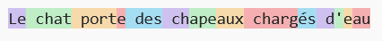

# Tokenization et Embedding

## Principe général

Dans les LLM, on va injecter du texte pour toutes sortes d'opérations.
Ce texte doit être transformé en **séquences de vecteurs numériques** pour être traité par le modèle. C'est tout l'objectif de la tokenization.

De fait, un **token** est un morceau de texte (disons un mot pour fixer les idées au départ). Le LLM dispose d'un **dictionnaire de token** qui recense tous les tokens possibles. Chaque token à un **identifiant** unique.

Notre texte complet à encoder peut ainsi est remplacé par une succession d'entiers ou chaque entier est l'identifiant d'un token.

De fait, chaque entier (chaque identifiant) est transformé en *one hot vector*.
Notre texte devient donc une séquence de vecteur de taille $s \times d_{dict}$, avec $s$, le nombre de tokens dans le texte et $d_{dict}$, la taille du dictionnaire de token.

*Pour fixer les idées, dans Gpt3, la taille maximale d'une séquence vaut* $s=2048$*, et le dictionnaire de token à une taille* $d_{dict}=50257$*:*

En sortie, un LLM doit prédire un token (le prochain token d'une séquence), Il présente donc $d_{dict}$ neurones de sortie, permettant d'assimiler cette tâche à une classification.

Pour illustrer ceci, voici un exemple de tokenization obtenu avec le [tokenizer d'openAI](https://platform.openai.com/tokenizer) :

Chacune de ces portions colorées est un token, avec son identifiant.
La liste des identifiants du texte proposée est la suivante :

`[2486, 7999, 26433, 731, 549, 2480, 5454, 7936, 1756, 272, 38948]`

## Tokenization

Voyons donc comment cette transformation du texte en tokens est réalisée.
Cela se fait au sein d'un pipeline de tokenization :

1. Normalisation
2. Pré-tokenization
3. Tokenization
4. Post Processing

1. la normalisation, selon ce que j'en ai lu, consiste à supprimer les accents, mettre tout en minuscules, supprimer les espaces inutiles, pour simplifier le texte à encoder. *Dans la pratique de mes tests, le seul effet que j'ai pu observer est la transformation de "\n" et "\t" en espaces...*
2. la pré-tokenisation consiste à séparer le texte en mots, autour des espaces et de la ponctuation.
3. Le tokenizer : La liste des mot est alors passée au tokenizer, un algorithme pré-entrainé, qui va découper chaque mot en différents token.
4. Le post-processing : il va prendre en charge les espaces multiples, et eventuellement ajouter certains tokens spéciaux pour le LLM

Pour faire des tests plus précis, j'ai du utiliser d'autres tokenizers que ceux d'openAI, non disponibles en python. Les résultats sont donc différents de ceux présentés ci-dessus.

Voici le lien vers les [tests de tokenization](https://colab.research.google.com/drive/1JpRTi_T3KnMCpEzjUKzJN2lfWlTPLwDj?usp=sharing) que j'ai effectués. Je vais en reprendre certaines conclusions ici.

Pour la phrase :

`Le chat porte des \t \n chapeaux chargés d'eau`

le tokenizer produit la séquence :

`['Le', 'chat', 'port', '##e', 'des', 'ch', '##ap', '##eau', '##x', 'ch', '##ar', '##gé', '##s', 'd', "'", 'e', '##au']`

