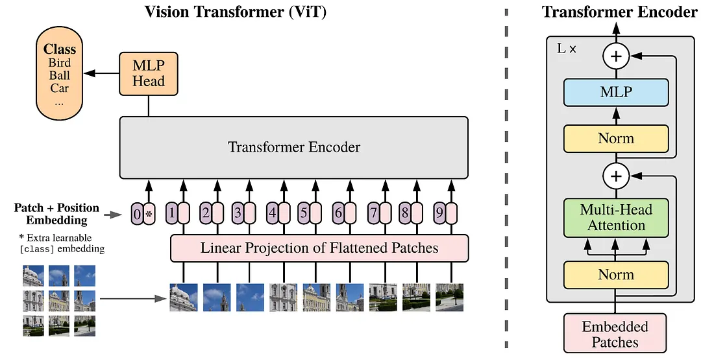
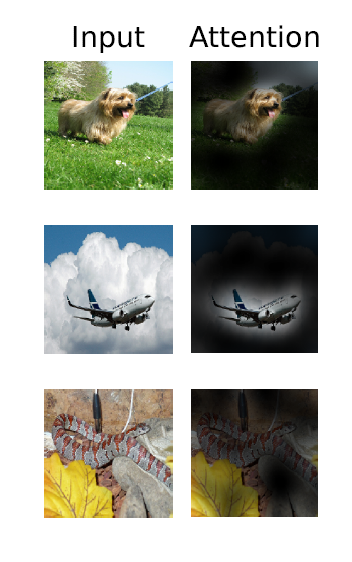

# Les Vision Transformers (ViT)

## Introduction

Les Vision Transformers, présentés dans ce papier : *An image is worth 16X16 words: Transformers for image recognition at scale, Dosovitskyi et al, ICLR 2021* appliquent un modèle de transformers **encoder only** aux problématiques de Computer Vision, en particulier la **classification**

Si l'idée d'utiliser des couches d'attention pour complémenter ou remplacer les CNN etait déja dans l'air du temps, c'est le premier réseau a présenter des performances equivalentes aux CNN. Depuis, on s'achemine vers une domination des Transformers, dans certains cas applicatifs (des grosses bases d'apprentissage).

Plus précisément, les ViT s'inspirent grandement de l'architecture de [Bert](BERT.md).

Pour fonctionner comme un LML, les ViT découpent l'image, considérée comme une **séquence** en patchs, qui seront les **tokens** traités.

## Architecture des ViT

l'architecture et le fonctionnement global d'un ViT sont présentés dans la figure suivante

Comme on peut le voir dans cette figure :

1. l'image est découpée en patchs, qui sont transformés en vecteurs de tokens
de dimension $e$ par une couche linéaire
2. on ajoute un token spécial `[CLS]`, appris, en début de séquence
3. on ajoute du **positional embedding** (appris), à la séquence.
4. on passe la séquence dans un Encoder Transformer. La sortie est alors une séquence de token enrichis.
5. Le premier token de cette sortie passe dans une tête MLP pour la classification finale.

L'idée sous jacente est, comme dans BERT, que le token CLS fournisse un résumé de l'image complète. On peut donc utiliser ce token pour de la classification.

Il me semblait très surprenant que le corps de l'article ne propose pas de faire un pretraining non supervisé, comme de l'**image masking**, mais ils en ont fait (section 4.6 self supervision) !

**Ceci pourrait être très intéressant quand on ne peut pas faire de pré-training supervisé sur une grande base (pour des données non RGB)**

## Pré training et downstream tasks

Un ViT doit être entrainé sur une grande base d'images. Pour les applications courantes utilisant des images RGB, il est possible de le **pré-entrainer** sur une grande base (en **classification** dans l'article originel), puis de le fine-tuner sur une tâche en aval (*downstream task*) utilisant une plus petite base.

Un point qui semble important dans l'article :

1. Il semble qu'il soit intéressant de fine-tuner à une meilleure résolution qu'à l'entrainement. Pour cela, ils gardent la même taille de patchs,
ce qui donne une taille de séquence plus grande.
2. De fait, *et j'avais du mal à le comprendre*, un **Transformer peut travailler sur une séquence de taille arbitraire** ! les matrices d'attentions apprises $Q_0, K_0, V_0$ sont de taille $e \times d$, indépendantes de la taille des séquences $s$. Les matrices d'attentions calculées $Q,K,V$ ont des tailles qui, elles, dépendent de $s$. Par exemple, $Q = Q_0 \times X$, avec $X$ une séquence d'entrée.
3. Néamoins, les **positions embeddings** n'ont alors plus de sens. Les auteurs font une interpolation 2D des positions embeddings des patchs, en fonction de leur position dans l'image originale.

## Quelques chiffres

### chiffres liés aux données traitées

- La taille des patchs retenue est, la plupart du temps, $16 \times 16$ pixels ($P=16$).
- la taille des images en entrée est fixée, les images sont éventuellement scaled en images de taille $i_s \times i_s$ . Plusieurs tests ont été effectués, avec $i_s \in\[64,512\]$. Un cas classique est $i_s = 224$

Avec ce types de données, une image est un tenseur de dimension $H,W,C$.
Pour l'extractions des patchs, on le redimensionne en $N = H/P \times W/P$ patchs de dimension $P \times P times C$. (**bizarre que 224 ne soit pas divisible par 16)

Une image est donc une séquence de $s = N = 228 / 16 \times 228 / 16 = 196$.
Chaque patch est initialement un vecteur de dimension $16 \times 16 times 3 = 768$, projeté par l'embedding dans un espace de dimension $e = 768$ aussi pour *ViT Base*. Il y aurait peut de sens à prendre un embedding de dimensions plus restreintes que les dimensions initiales. (*quoique... face à des contraintes mémoire...*)

### chiffres liés à l'architecture

Les ViT originaux travaillent avec les paramètres suivants, en fonction de leur version :

- ViT-Base
  - nombre de couches de transformers $L=12$
  - embedding size $e=768$
  - nombre de neurones du MLP final : 3072
  - nombre de têtes d'attentions par couche $h = 12$
  - nombre total de paramètres : 86M

On retrouve des paramètres comparables dans les autres versions (dans le même ordre) :

- ViT-Large 24 1024 4096 16 307M
- ViT-Huge 32 1280 5120 16 632M

## Quelques remarques

### ViT vs CNN

Comme remarqué dans l'article originel, sur des bases d'images de taille moyenne comme ImageNet (1.3M d'images ...), les performances des transformers sont en dessous de celles des CNN. En revanche, lorsque la taille des bases augmente
(> 14M d'images), le constat s'inverse.

Les auteurs explique ce phénomène par les biais d'induction inhérents aux CNN, tels que l'invariance en translation et la localité de l'information. Pour le second, cela signifie que par nature, le CNN utilise le voisinage des pixels pour ses opérations, là ou le Transformers devra apprendre à focaliser son attention sur les pixels locaux, le plus souvent.

En revanche, pour la même raison, les CNN peuvent avoir plus de mal à prendre en compte des informations spatialement très séparées, alors que les Transformers le font spontanément dans le mécanisme d'attention.

### Position embedding dans les ViT

Un point un peu annexe de l'article, surtout au vu des résultats, concerne le positional embedding. Il s'agit de signaler au réseau quelle est la position de chaque token dans la séquence (l'image). 

On dispose initialement d'une matrice de patchs de taille$\[H/P, W/P\]$. Une position est donc un couple d'entier. On peut linéariser cette matrice, pour encoder la position d'un patch sous forme d'un seul entier (**1D embedding**), ou encoder la position comme un couple d'entiers (**2D embedding**). On peut également recourir à des solutions plus élaborées pour **encoder la distance relative entre patchs**. Toutes ces solutions présentent des performances similaires. En revanche, elles sont toutes **bien meilleures que sans positional embedding**.

### des choses à observer

la figure 6 dans l'article, reproduite ci dessous, permet de visualiser
ce sur quoi porte l'attention du réseau dans les données d'entrées :

le caption est le suivant : *Representative examples of attention from the output token to the input space.*

J'imagine que c'est un mask de poids d'une matrice de pattern d'attention, appliqué à l'image d'entrée. Vu l'architecture du réseau, on peut imaginer que ce soit *la moyenne de toutes les matrices de patterns d'attention (?)*

Les auteurs signalent simplement que cela montre que l'attention est portée sur des **éléments sémantiquement utiles pour la classification**.

